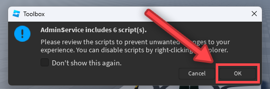
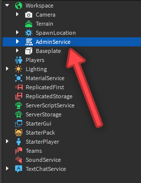
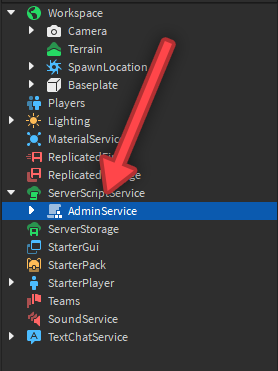
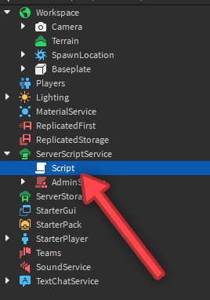

## AdminService

**The official documentation on the open source module 'AdminService,' the versatile, easy-to-work-with admin module for any and all Roblox developers to use!**

~~This website is very ugly right now. It will get better the more I learn how to use GitHub pages (and when I can learn how to use themes. Why did they have to take away the "Change Theme" button. It was so simple, now I have no idea what to do, the documentation is extremely unhelpful, and I can't find any videos online about it. Someone please help 😭😭😭😭😭😭)~~

---

### What is AdminService?

AdminService is an open source module meant to make admin commands easy!

---

### Setup
Most, if not every admin command module or system, like  requires no setup. With the way AdminService is designed, it unfortunately does, but it can be done in three lines.

Despite needing setup via another script, but as mentioned, only needs three lines; however, you need to insert the module before you can do anything else.

If you don't have the module, [get it here](https://create.roblox.com/marketplace/asset/14663644773/AdminService)

Then in Studio, you need the toolbox open if you don't already. Go to the `Home` tab at the very top, or the `View` tab, and click the `Toolbox` button in either tab.
Next, you have to insert the module by going to "My Models," which is the button that has four squares.

Here is an image pointing where you need to go:


Then you click on the model to insert it:


It may prompt you with a notification saying the model includes scripts. Just click "Ok" to insert it:



Next, it should appear in the `Workspace`. Drag it from there into `ServerScriptService`, or into a folder in `ServerScriptService`. You could also put it in `ServerStorage` or a folder in there instead.




Then insert a new script into `ServerScriptService`:



Then inside of the script, add the following three lines of code:
```lua
local Players = game:GetService("Players") --// Accesses the Players service. This is "Players" in the Explorer.
local AdminService = require(script.Parent:WaitForChild("AdminService")) --// Gets the AdminService module to be used, and sets everything else needed up automatically after running.

Players.PlayerAdded:Connect(AdminService.init) --// Runs the initializer for the player and sets everything up for them.
```

And boom, you've setup AdminService!

---

### The `_aux` module

`D.R.Y.` One of the most basic and most important rules in programming. It stands for Don't Repeat Yourself, and it should always be followed! It's a method of organizing your code so it doesn't turn into what is called "spaghetti code," which is a term used to describe programming that is very disorganized, poor, ugly, slow, and overall a nightmare. That at least is my connotative definition of it.

Anyway, enough side tracking; the `_aux` module, short for "auxiliary", is used to help keep organized and follow `D.R.Y`. This is accomplished by using a function to check the "player status," so whether or not a player variable was entered as "all" or "other," or if it was just a player instead.
