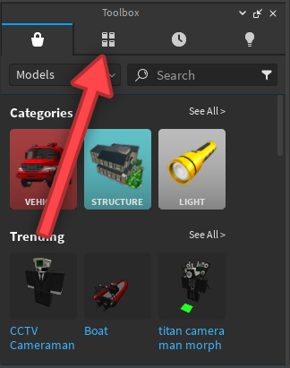
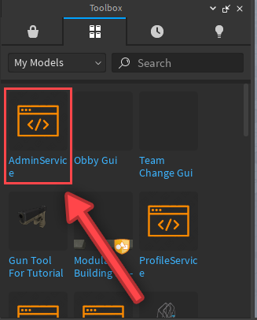
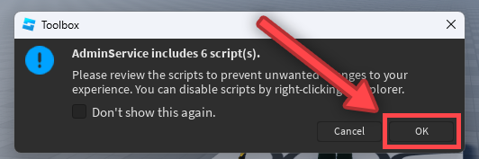
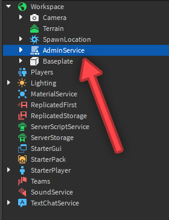
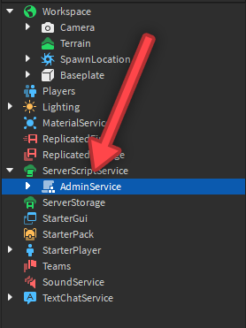
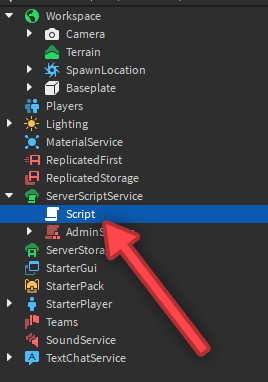

# Setup

!!! notice
    Small amounts of setup is needed. Without it, AdminService will not work!


Most, if not every admin command module or system requires no setup. With the way AdminService is designed, it unfortunately does, but it's done in only three lines of code!

Despite needing setup via another script as already mentioned, it only takes three lines of code; however, you need to insert the module before you can do anything else.

If you don't have the module, [get it here](https://create.roblox.com/marketplace/asset/14663644773/AdminService).

---

In Studio, you need the toolbox open if you don't already. Go to the `Home` tab at the very top, or the `View` tab, and click the `Toolbox` button in either tab.
Next, you have to insert the module by going to "My Models"



Then you click on the model to insert it:



It may prompt you with a notification saying the model includes scripts. Just click "Ok" to insert it:



Next, it should appear in the `Workspace`. Drag it from there into `ServerScriptService`, or into a folder in `ServerScriptService`. You could also put it in `ServerStorage` or a folder in there instead.




Then insert a new script into `ServerScriptService`:



Then inside of the script, add the following three lines of code:
```lua
local Players = game:GetService("Players") --// Accesses the Players service. This is "Players" in the Explorer.
local AdminService = require(script.Parent:WaitForChild("AdminService")) --// Gets the AdminService module to be used, and sets everything else needed up automatically after running.

Players.PlayerAdded:Connect(AdminService.init) --// Runs the initializer for the player and sets everything up for them.
```

!!! warning
    AdminService should never be ran by a script, or be parented outside of (or have a common ancestor that isn't) `ServerScriptService` or `ServerStorage`. It could easily be accessed by an exploiter and abused.
    AdminService should also never be ran by a `LocalScript`, but it can't be in the first place if it's parented to (or has the common ancestor of) `ServerScriptService` or `ServerStorage`.

---

And boom, you've setup AdminService!

[Next Page](https://amorafolf.github.io/AdminService/basics/_aux_module/){ .md-button .md-button--primary }